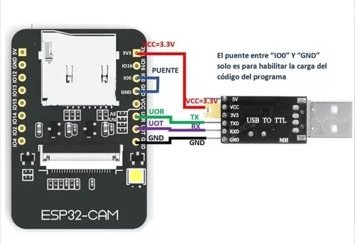
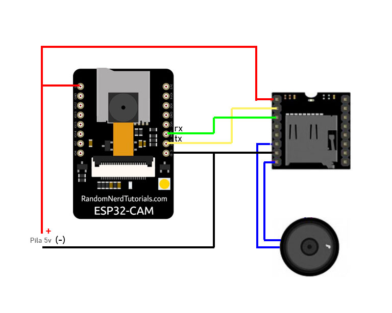

# PROYECTO HORUS: Asistente para no videntes

Código demo en C de ARDUINO para el consumo de la API de reconocimiento (Proyecto Horus)

El Proyecto Horus consiste en una API REST que permite de forma simple identificar imagenes via redes neuronales.

# Como cargar el codigo en la ESP32-CAM

Para copiar el codigo a la ESP32-Cam se requiere de un adaptador USB-TTL el cual ira conectado de la siguiente manera:

La configuración del entorno arduino para la carga sera:

Nota: Si hay problemas para subir el codigo a la placa y todo parace corresponder correctamente debera probar invirtiendo el RX y el TX de la placa TTL.

# Conexionado entre la ESP32-cam y el MP3 Player

Una vez todo conectado se debe descomprimir el contenido del archivo ZIP en una tarjeta SD y luego instalarla en el reproductor MP3

La URL a usar en el codigo de ejemplo es:
https://server1.proyectohorus.com.ar

El usuario, Password y Perfil se obtienen en https://www.proyectohorus.com.ar.

Ejemplo de como usar el administrador aca:

https://www.youtube.com/watch?v=pf7yy0KpRks&t=3s
